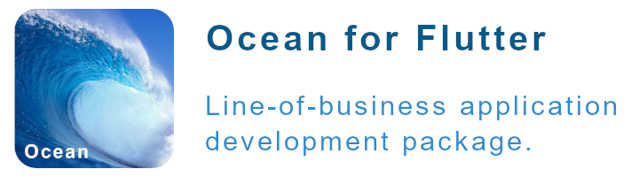

<!-- 
This README describes the package. If you publish this package to pub.dev,
this README's contents appear on the landing page for your package.

For information about how to write a good package README, see the guide for
[writing package pages](https://dart.dev/guides/libraries/writing-package-pages). 

For general information about developing packages, see the Dart guide for
[creating packages](https://dart.dev/guides/libraries/create-library-packages)
and the Flutter guide for
[developing packages and plugins](https://flutter.dev/developing-packages). 
-->



# Ocean for Flutter with Example App
> NOTE: I'm putting this on GitHub, so others can see what I'm doing with Flutter. I need this now for several production apps I'm writing. Sometime in the spring of 2022, I'll add comments, create API docs, and upload this package to pub.dev. I don't want to push this to pub.dev until I've had a chance to flush out more. Also, I need to stay focused on the apps I'm writing and not other tasks.

## Question Comments Please Use the Discussions Tab, Thank You!
[Ocean - Discussions](https://github.com/longtimedeveloper/ocean/discussions/1)

## Purpose
The purpose of Ocean for Flutter (Ocean), is to make writing robust Flutter line-of-business applications easier, quicker, and with less code. 

The focus and greatest productivity gains are in data form development.

Ocean provides declarative validation, declarative case correction, and declarative string formatting that is applied when entity object properties are updated by the UI, or in the business logic or service layers. 

Ocean provides rich APIs for easily displaying preconfigured dialogs and snackbars.

Ocean provides command objects (similar to .NET WPF) exposed by the viewmodels, and command buttons that are sinks for the command objects. With these objects, it is effortless to enabled or disable UI buttons based on viewmodel state.

The included example application showcases Ocean in these forms:

* Sign In
* User Registration
* Application Settings
* Customer Edit

Ocean provides infrastructure that enables incredibly easy data form creation for Flutter apps without requiring any state management or providers. 

Backed by declarative metadata, the below code snippet provides high-octane text entry for the `Customer` `firstName` property. The first name entry will be validated against one or more validation rules, case correction rules, and string formatting rules. The labelText, helperText, hintText, keyboardType, autoFocus, obscuring of text, etc., are provided by metadata.  See below, no magic strings or inline validation, etc.

```
OceanTextFormField(
  propertyName: Customer.firstNamePropertyName,
  businessObjectBase: customer,
  propertySetter: (value) => customer.firstName = value,
  propertyGetter: () => customer.firstName,
),
```

## Why Did I Write Ocean?
When developing any type of application my two highest priorities are:
* Delight the customer, meet or exceed all business requirements.
* Create an app that is easy to maintain over time.

These two priorities drive my decision making and software architecture.

## Is Ocean For You?

**If you answer 'no' to these questions, then Ocean's assets, techniques, and philosophy may not be what you're looking for.**

1.  Do you consistently practice DRY and SOLID principles in your daily software development?
2.  Based on the question 1, do you practice loose coupling when architecting your applications?
3.  Do you use appropriate Gang of Four Design Patterns in your development?
4.  Would you like to write and prioritize writing applications that are easy to maintain over time?
5.  Do to write code that is easy to test?
6.  Do you use dependency injection for resolving dependencies?
7.  Do you strive to never use magic strings or numbers in your code?
8.  Do you strive to have a single source of truth for the application metadata? For example, label text, hint text, validation rules, etc. 
9.  Would you like to effortlessly build your data forms driven by easy to test metadata and declarative rules?
10. Do you abstract what varies?
11. Do you program against an interface (abstract class in Dart) or do you program against concrete classes and implementations?

If your app has two data forms, you may not need this.  Personally, I use it on apps even with a single data form or many data forms. I do this so that I'm always programming the same way, using time-tested architectural patterns.

If your still unsure, watch the below Ocean for Flutter videos.

> IMPORTANT: Just because you answered no to one of the above questions, does not imply you're not a good or great developer, or that there is something wrong. My goal with these questions is to save time for those who's focus and daily practices don't include the above.


## My Background
I wrote my first computer program in 1974 in Junior High School; we had a big Honeywell machine and used a hard-copy teletype with paper tape readers/writers.

I've been a Software Architect and Engineer since 1989.  Loved every day since.

In June 2007, I became a WPF fanatic and started writing line-of-business desktop applications. I wrote the Ocean framework for WPF, Silverlight, Blazor, console application, and ASP.NET Web Services. Ocean is based directly on the .NET Ocean Framework that is being used in large production applications.

Karl, where did the name Ocean come from. Because, I wrote it on a cruise! I've done 5 coding cruises. Each cruise I wrote something different and shipped it when I got back.

## Flutter Journey

I've been a Flutter hobbyist for a little while.  Then in Sept 2021, I got serious with Dart and Flutter because, I want to write several multiplayer games that can be played with others over the Internet, along with several other cool applications.

Beginning Monday, 24 Jan 2022, I'm writing a Windows Desktop and Android mobile app for a Veterans Organization that enables them to interact with the Veterans Administration.  This will greatly improve their services to the veterans they serve. 

## Why Ocean

Like most developers coming from other languages, I learned Dart and then Flutter. I read the Dart and Flutter docs, read blog posts, did several Udemy Courses, and watched a lot of YouTube videos.

Flutter State Management bubbled up as a hot topic, with many options for state management.  After watching 20+ YouTube videos on the subject, read many blog posts, I ran into this splendid article that challenged the status quo, [Flutter state management for minimalists](https://suragch.medium.com/flutter-state-management-for-minimalists-4c71a2f2f0c1) by [Suragch](https://suragch.medium.com/flutter-and-dart-development-articles-981be9ef7b23).

I also browsed the Flutter Docs [List of state management approaches](https://docs.flutter.dev/development/data-and-backend/state-mgmt/options).

Keep in mind, different scenarios in Flutter may require simple state management while others could be more complex. Please don't break out your Golden Hammer ([Anti-patterns You Should Avoid in Your Code](https://www.freecodecamp.org/news/antipatterns-to-avoid-in-code/#:~:text=Anti%2Dpatterns%20You%20Should%20Avoid%20in%20Your%20Code)) when thinking about state management.

I also found that since 2019, quite a few Forms and Validation packages have been published on [pub.dev](https://pub.dev/packages?q=forms). Some of them were written to avoid having to use a 3rd party State Management solution.

Ocean was written to move responsibility for the business entity state and rules from the Form widget to the entity class.  Many Flutter apps I've seen, have the UI maintaining states, responsible for validation rules, etc. For demo's, super, but not a great approach for production applications.

For line-of-business applications it is **CRITICAL** that the UI layer not take on the responsibility for managing or storing application state. Obviously, the Flutter Team provided a solution with the Form widget for getting an application developed quickly and that works, no question.  

However, non-demo small, medium, or large apps with multiple logical or physical layers, having validation logic and other state in the UI layer is a non-starter because the developers will have to repeat code in other layers to have the same functionality. In the .NET WPF world, MVVM became a very popular design pattern that solves this exact problem, by enforcing the decoupling of code, as well as keeping it DRY.

Because the entity is responsible for its state, the entity can be verified at each layer.  In many applications, business processing may dictate that a valid object be mutated in the business layer. The business layer must confirm the entity is valid after it mutates state.  If not, big problems will occur.

[Rockford (Rocky) Lhotka](https://lhotka.net/) wrote and maintains [CSLA.NET](https://cslanet.com/) for this very reason for .NET applications.

> What I've done here is not the only way to solve these common types of problems.  This is how I architect and program my personal and professional line-of-business applications. I used these same patterns for .NET, Angular, and now Flutter.

## Description
Ocean empowers and guides developers for a great MVVM data form development experience. The package provides a rich business object base class that provides validation, case correcting, and string formatting services when used in a data form, service layer, business processing layer, etc.

This is one of the critical reasons Ocean was written in the first place many years ago.  Validation is a must in all layers of an application. Like databases, business objects need to be able to protect themselves from users in the UI layer, and from developers in the business and service layers.

### Provides
- Conforms to Dart Null Safety.
- Works with both null-able and non-null-able primitives in entity properties.
- Works on all supported Flutter platforms.
- Works without any Flutter state management packages such as Provider, Riverpod, etc.
  - The example program uses `getIt` for IOC.
- Rich declarative validation rules
  - `BankRoutingNumberValidator`
  - `BooleanRequiredValidator`
  - `ComparePropertyValidator` - cross field validation
  - `CompareValueValidator`
  - `CreditCardNumberValidator`
  - `DomainValidator`
  - `MultipleOfValidator`
  - `PasswordValidator` and `PasswordStrength` measuring tool.
    - Require min-max length, lower case, upper case, digit, user defined special characters, prevents sequences of numbers or letters (123, abc, CBA, 321, etc.).
  - `RangeValidator`
  - `RegularExpressionValidator`
  - `StringLengthValidator`
  - `USStateAbbreviationValidator`
    - Includes `StateAbbreviationNameTool` for supplying valid state abbreviations and names.
- Powerful `BusinessObjectBase` class that:
  - Maintains object state (dirty, valid, broken rules, etc.)
  - Runs validation rules when properties are updated
  - Runs text case correction and string formatting when properties are updated
  - Provides detailed default validation error messages, with rich customization options if required.
  - Provides an object `activeRuleSet` property that is used to determine if a validation rule should run or not, based on the object state. 
    - Example, insert, and update states may have different validation requirements, and this is very easy to accomplish.  User defined states are supported.  Another use case is an entity within a workflow.  Think insurance claim that has many states such as: opened, reviewed, approved, rejected, paid, etc. You can have different validation rules for a property based on its rule set to fully support these scenarios.
  - Provides a callback that other classes can sign up for to be notified when the `isValid` property changes. 
    - Using a callback is super simple and requires no Flutter state management library or system. The example app uses this to enable or disable the Save button in real-time as the user enters data in the text field.
- Rich character casing formatting based on declarative rules.
- Rich string formatting based on declarative rules.
- `OceanTextFormField` widget
- `OceanPasswordFormField` widget for registration forms where the user in creating their password for the first time.  
  - The widget handles getting the password, displaying the password strength real-time, and provides a conform password entry field. The password widget is easily customized based on your business requirements for length, lower case, upper case, digits, special characters, and preventing of sequences such as, 123, abc, 321, aaa, etc.
- `OceanCheckboxFormField` widget
- `OceanDropdownFormField<T>` widget
- `OceanSliderFormField` widget
- `OceanSwitchFormField` widget
- `FormMetadataFacade` provides an API and bridge between the Ocean Form Field widgets and entity classes. The facade handles the mismatch between the way the Flutter Form widget works and the way Ocean needs the entity to be updated. This is handled transparently.
- API for easily configuring and displaying a `SnackBar` from the view model or other code where.
- API for easily configuring and displaying a `Alert` or other dialogs from the view model or other code where.
- API for exposing a `Command` from the viewmodel that widgets in the UI, such as a button, can respond to and invoke the method referenced by the `Command`.
- Ocean library has 100% code coverage unit tests.
- Ocean has some comments, I'll complete these in the future.

## Example Demonstrates
The example Flutter application demonstrates using Ocean with MVVM data entry views.  Please see the code in the example folder for how to use Ocean.

`app_startup` folder contains files necessary for bootstrapping an Ocean application.

`infrastructure` folder contains application specific implementations of command buttons, dialogs, logger, snackbars, and a viewmodel base.

`models` folder contains the application business entities.

`views` folder contains the view and viewmodels for the application.

## Future Development
After I ship the Veterans Organization app, and the two games, I'll turn my attention to making this package production ready and share on pub dev.

- `RangeSliderFormField` widget
- `AutoCompleteFormField` widget
- Random password generator
- High-octane sample data generator
- Support for complex properties with nested classes.
- Comment Ocean
- Write the API docs.
- Adopt Very Good Analysis - waiting until after all the comments are added.
- Create videos

**FINALLY** publish Ocean on pub.dev!

## Limitations or Known Issues
Not expecting nested business entity map returned from entity `toJson()`. Also known as complex properties.  I'll add support for these later on.

Will consider feature requests.

## Flutter and Dart (IMHO)
I love Flutter and Dart for many reasons.
- Outstanding project leader [Mr. Tim Sneath](https://twitter.com/timsneath), can not say enough kind words about Tim. Splendid person, leader, manager, developer, with great character, and a forward thinker.
- Professional, technically excellent, and friendly Flutter and Dart Team - my interactions with team members have been very good, leading me to trust them the way I did the Microsoft WPF and patterns and practices teams.
- Superb Flutter and Dart community that contributes to the SDK's, provides guidance, and courses.
- Compiles to web, Windows, macOS, Linux, Android, and iOS.
- IMHO the best web application, web line-of-business application development platform in the world.
- I'm now using Dart for all my command line applications I write. Have written some very cool tools that I use for development tasks.
- Visual Studio Code support is the very best tooling for development I've used.  The instant hot-reload makes UI authoring painless. See my below list of VS Code Extensions I use for Flutter & Dart development.
- Flexible options for application navigation, thank you!
- Strong typing, null safety.
- *Google pleased don't hate me.* Flutter works great with Microsoft Azure too!  All my games use Azure Functions, Azure Table Storage, and Azure SignalR. For me, Azure was a snap to get up and running with Flutter as I have a lot of experience with it.  
  - I was a little hesitant about taking on Firebase and the frequent API changes and lack of support for FlutterFire Windows and some web stuff.  These are all being addressed, but I need it today. My last Azure app ran for 3 years without me having to touch it. You can use Azure without any Flutter or Dart dependent packages, just HTTPS.
  - Don't let me discourage you from using Firebase, it is an outstanding product and service.
- When required, rich community driven packages you can easily add to your apps.
- **Instant Viewing and Debugging of ALL source code**, Flutter, Dart, and any package you've added. Use your editor's 'go to definition' short-cut for any type.  This makes it easy to see how Google or the community wrote the code, and troubleshoot unexpected behaviors, set a breakpoint, and if required submit a change request, feature request, or file an issue after doing your homework.
- Learn how the Flutter team wrote the widget UI tests by viewing their code. This makes learning to write UI tests easy.

### My Flutter and Dart VS Code Extensions

| Name                     | Author Name                   |
|--------------------------|------------------------------:|
| Awesome Flutter Snippets | Nash.awesome-flutter-snippets |
| Bookmarks | alefragnani.Bookmarks | 
| Code Coverage | markis.code-coverage | 
| Command on All Files | rioj7.commandOnAllFiles |
| Dart | Dart-Code.dart-code | 
| Dart Barrel File Generator | miquelddg.dart-barrel-file-generator | 
| Flutter | Dart-Code.flutter | 
| flutter-stylizer | gmlewis-vscode.flutter-stylizer | 
| LTeX grammar/spell checking | valentjn.vscode-ltex  |
| Markdown Preview Enhanced | shd101wyy.markdown-preview-enhanced |
| Remove Comments | plibither8.remove-comments |
| Todo Tree | Gruntfuggly.todo-tree |
| vscode-icons | vscode-icons-team.vscode-icons |


## Closing

I hope you're having as much fun and productivity as I am learning and working with Flutter and Dart.  

Have a wonderful and bless day!

Karl

[Karl Twitter (Long Time Developer)](https://twitter.com/ancientdevelop2)

[Karl YouTube (Long Time Developer)](https://www.youtube.com/channel/UC9Cr20T0AnyOF4_Nys2tq5g)

Blog - thinking about it.